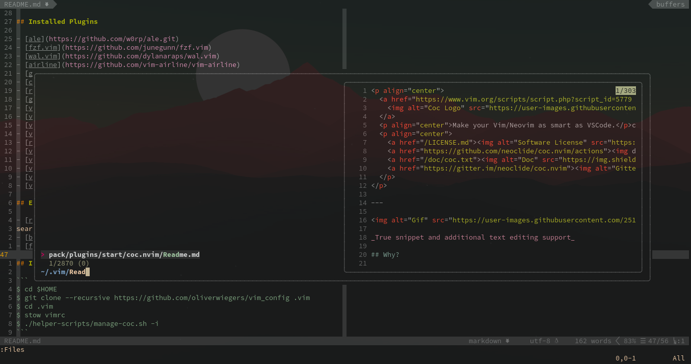

# Vim config

Nothing to fancy just my vim config.

Once I was trying to solve as many problems without plugins and came up with 
solutions replacing plugins like
[Nerdcommenter](https://github.com/scrooloose/nerdcommenter). But at some point
I noticed I was reinventing the wheel. It was a great journey and I learned alot
about Vim. 

In the end I started to use some fancy looking and helpful plugins again. After
all the goal is the same, keep this configuration as portable as possible. When
I was working on an Android tablet using Termux I started using the most minimal
configuration possible.

All used plugins are written in plain VimL and a little bash.

## Installed Plugins
- [ale](https://github.com/w0rp/ale.git)
- [wal.vim](https://github.com/dylanaraps/wal.vim)
- [airline](https://github.com/vim-airline/vim-airline)
- [nerdtree](https://github.com/scrooloose/nerdtree.git)
- [vim-devicons](https://github.com/ryanoasis/vim-devicons.git)
- [vim-fugitive](https://github.com/tpope/vim-fugitive.git)


## Installation

```
$ cd $HOME
$ git clone --recursive https://github.com/oliverwigers/vim_config .vim
$ cd .vim
$ stow vimrc
```

## Look

Currently using wal theme with colors from void linux wallpaper.


The configuration for polybar on top can be found at
[oliverwiegers/dotfiles](https://github.com/oliverwiegers/dotfiles).
